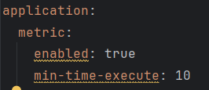

# Задание: Performance Monitoring Starter
В отдельном модуле spring-metric ru.clevertec.springbootmetricstarter.annotation создаем аннотацию @MonitorPerformance,  
которую в примере поставим над методом в основном проекте car-dealer carService.findById(Long id) и затем мы получим время выполнения этого метода, если оно будет больше минимально требуемого, в примере 10 мс.   
Аннотацию можно вкл/выкл и установливать порог времени срабатывания в application.yml основного проекта
значениями enable и min-time-execute соответсвенно  

  

В модуле spring-metric реализована логика обработки это аннотации.  
PerformanceMonitorProperties.java мапит данные из yml файла на свои поля аннотацией @ConfigurationProperties  
PerformanceMonitorAutoConfiguration.java подтягивает properties класс и проверяет условие включены ли метрики  
Если да создается бин PerformanceMonitorAspect.java. Который, в свою очередь, с помощю АОП библиотеки org.aspectj.lang перехватывает
выполнение метода, который будет аннотирован @MonitorPerformance, и высчитывает разницу времени между началом и кончанием
выполнения и метода и выводит лог с этим значение.  
Формат выводa Method [methodName] executed in [executionTime] ms.  
Был создан файл META-INF/spring/org.springframework.boot.autoconfigure.AutoConfiguration.imports содержащий имя конфиг класса,  
для того, чтоб Boot знал, какие классы автоконфига подгружать при запуске приложения.  
Был создан скрипт в build.gradle для опубликования jar в локальный maven repository.  
И затем в основной проект была добавления зависимость на этот jar.

Результат:

# Hibernate в проекте "Автосалон" 
### Требуется
1. Внести resources/hibernate.cfg.xml настройки для подключения к базе данных
2. Заполнить базу при помощи скрипта init.sql
3. Или же добавлена функция DDL  DML оперций Liquibase 
### Проверка работы методов в тестах ru.clevertec.dealer.service.CarServiceTest

### Для добавления 
Добавление автомобиля в автосалон.\
Привязки автомобиля к клиенту при покупке.\
Добавление отзыва клиента на автомобиль.\
### реальзованы соответствущие методы в сервисном слое
### организован поиск автомобиля по фильтру с помощью Criteria API класс-фильтр CarParam содержащий поля-фильтры с пагинцией номера старницы и количества записей на ней, пример в тесте ru.clevertec.dealer.service.CarServiceTest.getCarsByFilter
### организован поиск отзывов по ключевым словам ru.clevertec.dealer.dao.ReviewRepository.findByKeywords

## Решение проблемы N+1 
### Все отношения находятся в Lazy
### Над коллекциями стоит FetchMode.SUBSELECT

### Добавлен вывод статистики по забронированным автомобилям с помощью PostProcessor

