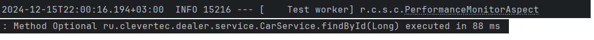

# Задание: Performance Monitoring Starter
В ru.clevertec.springbootmetricstarter.annotation создаем аннотацию @MonitorPerformance,  
которую в примере поставим над методом carService.findById(Long id) и затем мы получим время выполнения  
этого метода, если оно будет больше минимально требуемого, в примере 100 мс.
Результат:

# Hibernate в проекте "Автосалон" 
### Требуется
1. Внести resources/hibernate.cfg.xml настройки для подключения к базе данных
2. Заполнить базу при помощи скрипта init.sql
3. Или же добавлена функция DDL  DML оперций Liquibase 
### Проверка работы методов в тестах ru.clevertec.dealer.service.CarServiceTest

### Для добавления 
Добавление автомобиля в автосалон.\
Привязки автомобиля к клиенту при покупке.\
Добавление отзыва клиента на автомобиль.\
### реальзованы соответствущие методы в сервисном слое
### организован поиск автомобиля по фильтру с помощью Criteria API класс-фильтр CarParam содержащий поля-фильтры с пагинцией номера старницы и количества записей на ней, пример в тесте ru.clevertec.dealer.service.CarServiceTest.getCarsByFilter
### организован поиск отзывов по ключевым словам ru.clevertec.dealer.dao.ReviewRepository.findByKeywords

## Решение проблемы N+1 
### Все отношения находятся в Lazy
### Над коллекциями стоит FetchMode.SUBSELECT

### Добавлен вывод статистики по забронированным автомобилям с помощью PostProcessor

